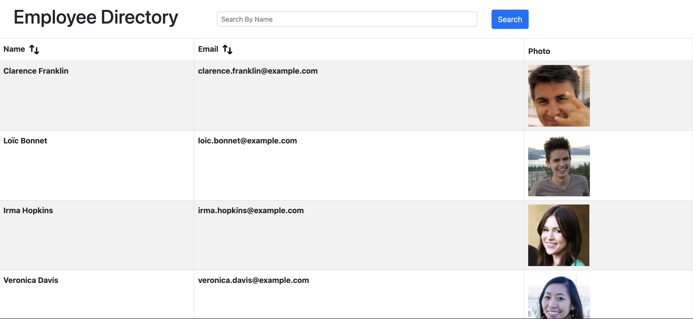
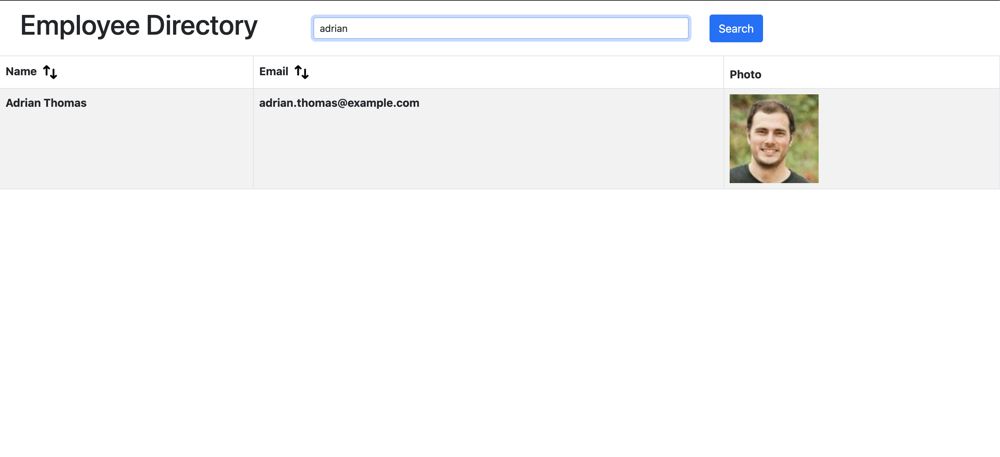
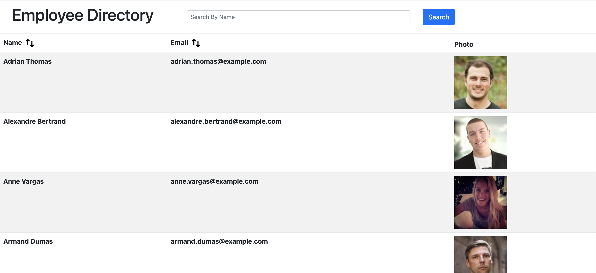

# Employee Directory 

This week's project had us build an employee directory in React. The employees are collected through the random user API. This API call returns 35 American employees that are displayed on our page. This

## Search

Search for any employee in the search bar by name. 

## Filter

Filter the columns of name and email by clicking the column title. 

